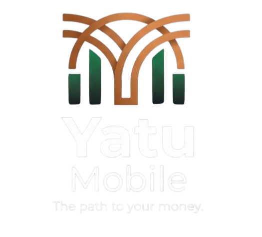

  

<h1 align="center">YatuMobile </h1>
<h2 align="center">Unified mobile money payments for Zambian businesses.</h2>

YatuMobile ("Our Mobile") is a mobile money payment aggregation platform. It gives businesses and developers a single, consistent interface for accepting and sending mobile money payments across Zambia's mobile network operators, instead of integrating with each operator separately.

The platform is designed around three principles:

* One integration, every network. A single API and dashboard in place of separate integrations with each operator.
* Security by design. Layered architecture, least-privilege access and continuous monitoring.
* Transparency. Clear pricing, clear terms and clear handling of customer data.
